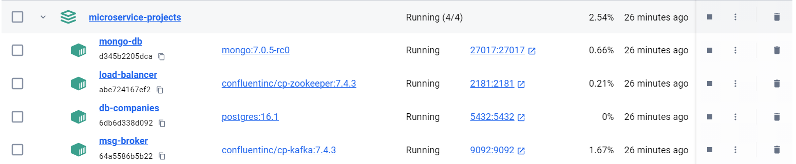
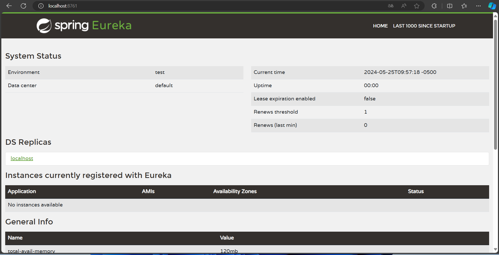
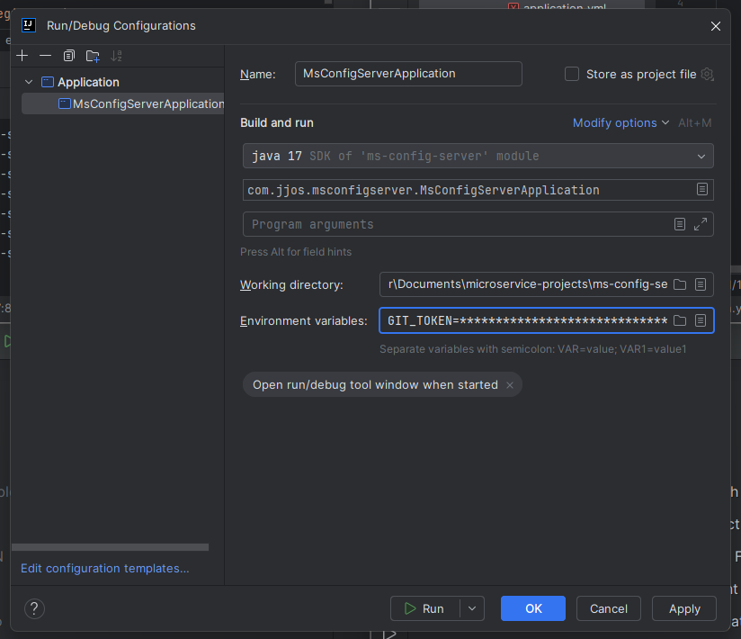
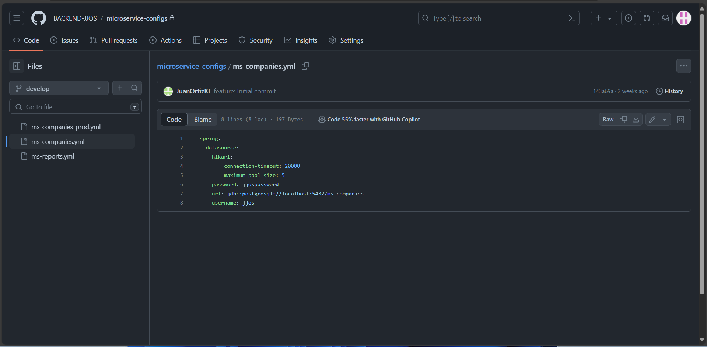
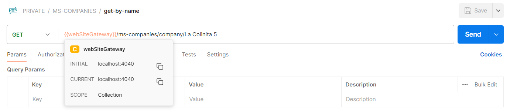
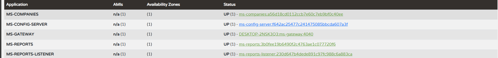

# Microservicios - Configuración Centralizada

Este repositorio contiene los proyectos trabajados producto del curso de  microservicios.

## Microservicios

1. **ms-registry-server:**
   
   Este microservicio actúa como servidor de registro y descubrimiento (Eureka) en el proyecto de microservicios.
   
    ## Características

   - **Servidor Eureka:** Proporciona un servidor de registro y descubrimiento para que los microservicios puedan registrarse y descubrirse entre sí dinámicamente.
  
   ## Configuración

   El archivo `application.yml` contiene la configuración del servidor, incluyendo el nombre de la aplicación, el puerto en el que se ejecuta y la configuración de Eureka.

   ## Dependencias Principales
   
   - `spring-boot-starter-actuator`: Proporciona puntos finales para monitorear y administrar la aplicación.
   - `spring-cloud-starter-netflix-eureka-server`: Configura el servidor Eureka en el microservicio.
   
   ## Ejecución
   
   Para ejecutar este microservicio, simplemente inicia la aplicación Spring Boot `MsRegistryServerApplication` desde tu entorno de desarrollo o mediante el comando `mvn spring-boot:run` en la raíz del proyecto.
   
   Para más información sobre cómo se integra este microservicio con otros componentes del sistema, consulta la documentación o el código fuente de los otros microservicios en el repositorio.

2. **ms-config-server:**
   
   Este microservicio actúa como servidor de configuración centralizada para proporcionar configuraciones a los otros microservicios del sistema.
   
   ## Características

   - **Servidor de Configuración Centralizada:** Proporciona un servidor para almacenar y distribuir configuraciones a través de los microservicios del proyecto.
   
   - **Integración con Eureka:** Utiliza Eureka como servidor de registro y descubrimiento para que otros microservicios puedan localizarlo y comunicarse con él.
   
   - **Conexión con Repositorio Git:** Se conecta a un repositorio Git remoto para obtener las configuraciones, lo que permite una gestión flexible y versionada de la configuración de la aplicación.
   
   ## Configuración

   El archivo `application.yml` contiene la configuración del servidor, incluyendo el nombre de la aplicación, el puerto en el que se ejecuta, la configuración de Eureka y la conexión con el repositorio Git.
   
   ## Dependencias Principales
   
   - `spring-cloud-config-server`: Habilita el servidor de configuración centralizada.
   - `spring-cloud-starter-netflix-eureka-client`: Integración con Eureka para el registro del servicio.
   - `spring-boot-starter-test`: Herramientas de prueba para aplicaciones Spring Boot.
   
   ## Ejecución

   Para ejecutar este microservicio, simplemente inicia la aplicación Spring Boot `MsConfigServerApplication` desde tu entorno de desarrollo o mediante el comando `mvn spring-boot:run` en la raíz del proyecto.
   

3. **ms-gateway:**
   
   Este microservicio actúa como un gateway para enrutar las solicitudes a otros microservicios del sistema.

   ## Características

   - **Enrutamiento de Solicitudes:** Proporciona rutas configurables para enrutar solicitudes a otros microservicios como ms-companies y ms-reports.

   - **Integración con Eureka:** Soporta perfiles de configuración para operar con y sin Eureka como servidor de registro y descubrimiento.

   ## Configuración

   El archivo `application.yml` contiene la configuración de la aplicación, incluyendo el puerto en el que se ejecuta, el nombre del perfil, y la configuración para Eureka.

   ## Dependencias Principales
   - `spring-cloud-starter-gateway`
   - `spring-cloud-starter-netflix-eureka-client`
   - `spring-boot-starter-test`
   
   ## Ejecución

   Para ejecutar este microservicio, simplemente inicia la aplicación Spring Boot MsGatewayApplication desde tu entorno de desarrollo o mediante el comando mvn spring-boot:run en la raíz del proyecto.

4. **ms-companies:**

   Este microservicio, parte de un proyecto basado en microservicios, está diseñado para gestionar la información relacionada con compañías. Utiliza Spring Boot y Spring Cloud para integrarse con otros componentes del sistema.
   
   ## Características
   
   - **Gestión de Compañías:** Proporciona endpoints para crear, leer, actualizar y eliminar información de compañías.
   
   - **Integración con Eureka:** Utiliza Eureka como servidor de registro y descubrimiento para que otros microservicios puedan localizarlo y comunicarse con él.
   
   - **Configuración Centralizada:** Se conecta a un servidor de configuración centralizada para obtener su configuración, lo que permite una gestión flexible y centralizada de la configuración de la aplicación.
   
   - **Base de Datos PostgreSQL:** Utiliza PostgreSQL como base de datos para almacenar la información de las compañías, con configuraciones que se obtienen dinámicamente del servidor de configuración centralizada.
   
   ## Configuración
   
   El archivo `application.yml` contiene la configuración de la aplicación, incluyendo el puerto en el que se ejecuta, el contexto del servlet, y la configuración para Eureka y el servidor de configuración centralizada.
   
   ## Dependencias Principales
   
   - `spring-boot-starter-actuator`
   - `spring-boot-starter-data-jpa`
   - `spring-boot-starter-web`
   - `spring-boot-devtools`
   - `postgresql`
   - `lombok`
   - `spring-boot-starter-test`
   - `springdoc-openapi-starter-webmvc-ui`
   - `spring-cloud-starter-netflix-eureka-client`
   - `spring-cloud-starter-config`
   
   ## Ejecución
   
   Para ejecutar este microservicio, simplemente inicia la aplicación Spring Boot `MsCompaniesApplication` desde tu entorno de desarrollo o mediante el comando `mvn spring-boot:run` en la raíz del proyecto.
   
   Para más información sobre el proyecto completo y cómo se integra este microservicio con otros componentes, consulta la documentación o el código fuente de los otros microservicios en el repositorio.

5. **ms-report:**

   Este microservicio, parte de un proyecto basado en microservicios, está diseñado para la gestión de reportes. Utiliza Spring Boot, Spring Cloud, Feign Client y Stream Kafka.
   
   ## Características
   
   - **Gestión de Reportes:** Proporciona endpoints para crear, leer y eliminar información de reportes.
   
   - **Integración con Eureka:** Utiliza Eureka como servidor de registro y descubrimiento para que otros microservicios puedan localizarlo y comunicarse con él.
   
   - **Configuración Centralizada:** Se conecta a un servidor de configuración centralizada para obtener su configuración, lo que permite una gestión flexible y centralizada de la configuración de la aplicación.
   
   - **Open Feign:** Utiliza feign client para conectarse con el microservicio de ms-companies y consumir el crud de ese micro, además de tener el balanceador de cargas configurado.

   - **Kafka Producer:**  Utiliza Kafka para producir un stream para que el microservicio de ms-report-listener realice los procesos necesarios. 
   
   ## Configuración
   
   El archivo `application.yml` contiene la configuración de la aplicación, incluyendo el puerto en el que se ejecuta, el contexto del servlet, la configuración  de servidor de zookeper y de kafka, la configuración para Eureka, el servidor de configuración centralizada.
   
   ## Dependencias Principales
   
   - `spring-boot-starter-actuator`
   - `spring-boot-starter-web`
   - `spring-boot-devtools`
   - `spring-cloud-starter-openfeign`
   - `lombok`
   - `spring-boot-starter-test`
   - `spring-cloud-starter-netflix-eureka-client`
   - `spring-cloud-starter-config`
   - `spring-cloud-starter-stream-kafka`
   
   ## Ejecución
   
   Para ejecutar este microservicio, simplemente inicia la aplicación Spring Boot `MsCompaniesApplication` desde tu entorno de desarrollo o mediante el comando `mvn spring-boot:run` en la raíz del proyecto.
   
   Para más información sobre el proyecto completo y cómo se integra este microservicio con otros componentes, consulta la documentación o el código fuente de los otros microservicios en el repositorio.

# Ejecución del proyecto

Ejecutar docker-compose para poder tener las bases de datos y servidores necesarios, en la ruta raíz ejecute:

docker-compose  up -d

Deberá ver algo así

1. **ms-registry-server**

   Ejecutar mvn spring-boot:run en la raiz del proyecto o Run desde Intellij Idea
   Abrir en el puerto indicado localhost:8761 deberá  ver el servidor de eureka listo
   

2. **ms-config-server** 
 
   Ejecutar mvn spring-boot:run en la raiz del proyecto o Run desde Intellij Idea
   Nota:  GIT_TOKEN está configurado en los environment variables indicando el token configurado en git para conectarse con el repositorio privado donde están las configuraciones de cada proyecto
   
   Microservice-config tendrá todas las variables a utilizar en cualquier microservicio y puede configurarse según el perfil
   

3. **ms-gateway** 
 
   Configurar en el application.yml que perfil utilizar `profiles.default: 'perfil a utilizar'`
   Ejecutar mvn spring-boot:run en la raiz del proyecto o Run desde Intellij Idea
   Ejecute un microservicio enrutando al gateway y el nombre del microservicio configurado en spring.application.name : 
   

4. **ms-companies**

   Ejecutar mvn spring-boot:run en la raiz del proyecto o Run desde Intellij Idea

5. **ms-reports**

   Ejecutar mvn spring-boot:run en la raiz del proyecto o Run desde Intellij Idea

6. **ms-report-listener**

   Ejecutar mvn spring-boot:run en la raiz del proyecto o Run desde Intellij idea

Podrá ver los microservicios registrados en eureka

